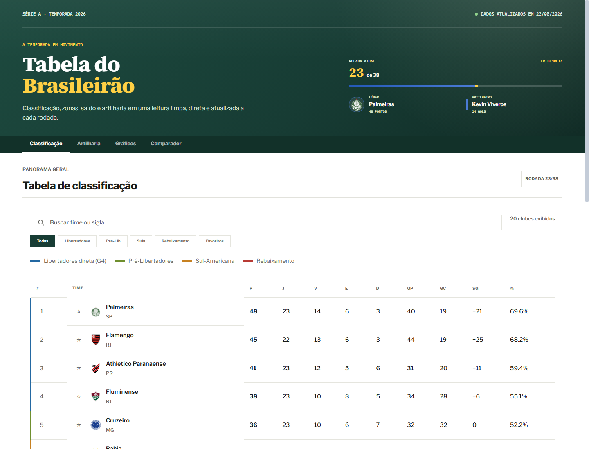
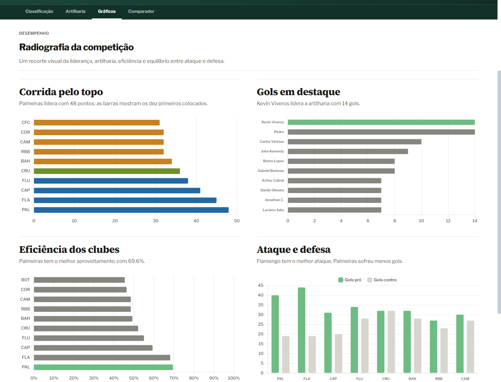

# Brasileirão Dashboard

[](https://github.com/lucasppinheiro/futebol-dashboard/actions)
[](https://futebol-dashboard.vercel.app/)

Dashboard editorial do Campeonato Brasileiro Série A com classificação, artilharia, gráficos, comparador de clubes e páginas individuais por time. O projeto combina dados oficiais da CBF, geração estática e uma interface inspirada em produtos jornalísticos esportivos.

**[Abrir demonstração](https://futebol-dashboard.vercel.app/)**

## Preview





## O que o projeto demonstra

- Produto web completo: coleta de dados, validação, build estático, publicação e interface responsiva.
- Automação confiável: GitHub Actions atualiza os dados, roda testes e só publica informações versionadas quando a validação passa.
- Cuidado com dados reais: a CBF é a fonte principal; football-data.org fica como fallback opcional.
- Engenharia de portfólio: rotas estáticas, páginas por clube, APIs JSON, sitemap, robots, página 404 e deploy na Vercel.

## Funcionalidades

- Tabela de classificação com filtros por zona, busca por clube e faixas laterais para Libertadores, Pré-Libertadores, Sul-Americana e rebaixamento.
- Artilharia em formato editorial, usando os dados disponíveis da fonte oficial.
- Gráficos de gols, aproveitamento e ataque/defesa com Chart.js.
- Comparador de clubes com escudos, métricas lado a lado e radar de desempenho.
- Páginas individuais por time geradas estaticamente.
- Vinte escudos oficiais preservados localmente, com versões transparentes e visualmente equilibradas.
- Endpoints JSON em `dist/api/` para classificação, artilharia, clubes, estatísticas e saúde dos dados.

## Arquitetura

```text
CBF oficial
    |
atualizar_dados.py
    |
validacao + escrita atomica
    |
data/brasileirao.json
    |
build_static.py
    |
dist/ -> Vercel
```

O GitHub Actions roda a cada hora, tenta atualizar os dados pela CBF, valida o JSON, executa os testes e só então commita o dataset. A integração Git da Vercel publica `main` automaticamente quando há novo commit.

## Desenvolvimento local

Requisitos: Python 3.10+ e Node.js 24+.

```bash
git clone https://github.com/lucasppinheiro/futebol-dashboard.git
cd futebol-dashboard
python -m venv .venv
```

Windows:

```powershell
.\.venv\Scripts\Activate.ps1
Copy-Item .env.example .env
```

macOS/Linux:

```bash
source .venv/bin/activate
cp .env.example .env
```

Instale e execute:

```bash
pip install -r requirements.txt
npm ci
python app.py
```

A aplicação estará em [http://127.0.0.1:5000](http://127.0.0.1:5000). Para buscar dados novos pela CBF, execute `python atualizar_dados.py`. O `FOOTBALL_DATA_TOKEN` só é necessário se você definir `DATA_SOURCE=football-data`.

## Qualidade e build

```bash
npm run test:python
npm test
npm run audit
npm run build
```

Para gerar exatamente o conteúdo servido pela Vercel:

```bash
python build_static.py
```

O resultado é escrito em `dist/`, incluindo páginas dos clubes, APIs JSON, `404.html`, `robots.txt` e `sitemap.xml`.

## Escudos dos clubes

Os arquivos recebidos da CBF ficam preservados, sem alterações, em `static/img/escudos/cbf/`. O site usa as versões de exibição em `static/img/escudos/normalizados/`, com fundo transparente, tela quadrada e margem proporcional para equilibrar formatos redondos, largos e verticais.

A normalização remove somente o fundo claro e neutro conectado às bordas. Áreas brancas internas, estrelas e demais elementos oficiais são mantidos. A arte não é recortada, esticada nem reamostrada durante o processo.

Para recriar os PNGs depois de substituir algum original da CBF:

```bash
pip install "Pillow>=12,<13"
python scripts/normalize_crests.py
```

O script exige exatamente os 20 arquivos JPG da temporada e gera novamente todos os PNGs. Não edite os arquivos normalizados manualmente.

## Dados e configuração

As variáveis disponíveis estão documentadas em `.env.example`. A fonte padrão é `DATA_SOURCE=cbf`, sem token. Se usar o fallback da football-data.org, mantenha `FOOTBALL_DATA_TOKEN` apenas em **Settings > Secrets and variables > Actions**.

Em execuções agendadas, uma falha temporária da fonte de dados não sobrescreve o dataset válido existente. Em execuções manuais (`workflow_dispatch`), o workflow falha para facilitar diagnóstico.

## Observações técnicas

- A aplicação é estática por escolha arquitetural: os dados são atualizados pelo GitHub Actions e publicados automaticamente pela Vercel.
- A CBF é usada como fonte principal; caso o formato da fonte mude, a rotina de coleta pode precisar de manutenção.
- Campos indisponíveis na fonte oficial não são inventados pela aplicação.

## Publicação na Vercel

1. Importe `lucasppinheiro/futebol-dashboard` no painel da Vercel.
2. Mantenha o diretório raiz como `.`; o `vercel.json` já define o build e a saída `dist`.
3. Use `main` como branch de produção.
4. Configure `SITE_ORIGIN` caso o domínio final seja diferente de `https://futebol-dashboard.vercel.app`.

Não é necessário cadastrar tokens na Vercel: a atualização ocorre no GitHub Actions e o JSON validado é versionado.

Nunca registre tokens no código, no histórico Git ou em arquivos versionados.
